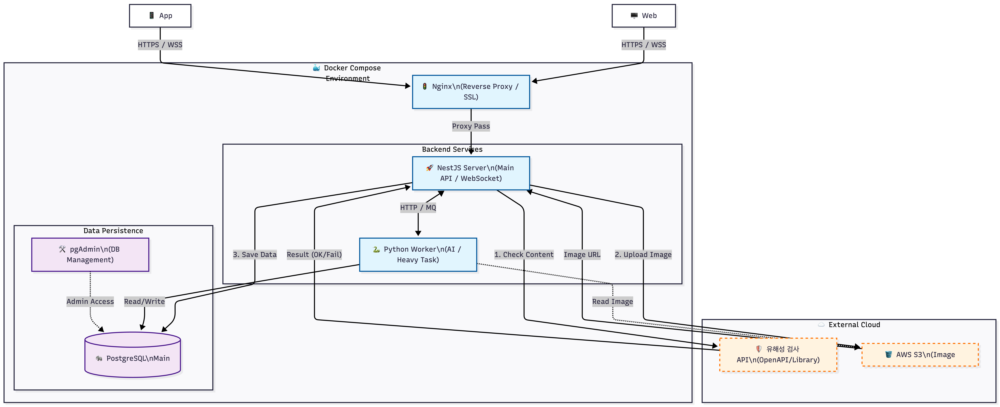

# ✌︎ -᷅ ̫̈-᷄ ✌︎  P I C S 
### (AI-Powered Creative Content Marketplace)
> **AI 기반 창작물 시세 분석 및 안전 거래 플랫폼** > 주관적인 창작물의 가치를 AI 데이터로 분석하여 객관적인 가이드라인을 제시하고, 안전한 거래 생태계를 구축합니다.

# ო͈̫  Project Timeline
- **Start Date** : 2026-01-12 ~ (진행 중)
---

## ⎝㋡⎠ Tech Stack
- **Framework**: Nest.js (v10+)
- **Language**: TypeScript
- **Database**: PostgreSQL (Managed via pgAdmin)
- **ORM**: TypeORM
- **Architecture**: Modular Domain Driven Design




---

## ⋆◡̎⋆ Project Structure (ERD 기반 모듈 설계)
Nest.js CLI를 활용하여 도메인별로 엄격하게 분리된 구조를 지향합니다.

- **Users**: 회원가입, 로그인 및 판매자 인증 관리
- **Products**: AI 검수 기반 창작물 등록 및 조회
- **Orders**: 주문 프로세스 관리
- **Payments**: 결제 이력 및 환불 내역 추적
- **Disputes**: AI 시세 분석을 통한 가격 분쟁 조정

---

## ʕتʔ commit 규칙

| 타입       | 의미            |
| -------- | ------------- |
| feat     | 새로운 기능        |
| fix      | 버그 수정         |
| chore    | 설정, 빌드, 초기 세팅 |
| refactor | 리팩토링          |
| docs     | 문서            |
| test     | 테스트           |

---

## =͟͟͞͞Ꙭ̯ Getting Started

### 1. 환경 변수 설정
프로젝트 루트에 `.env` 파일을 생성하고 pgAdmin 정보를 입력하세요.
```env
